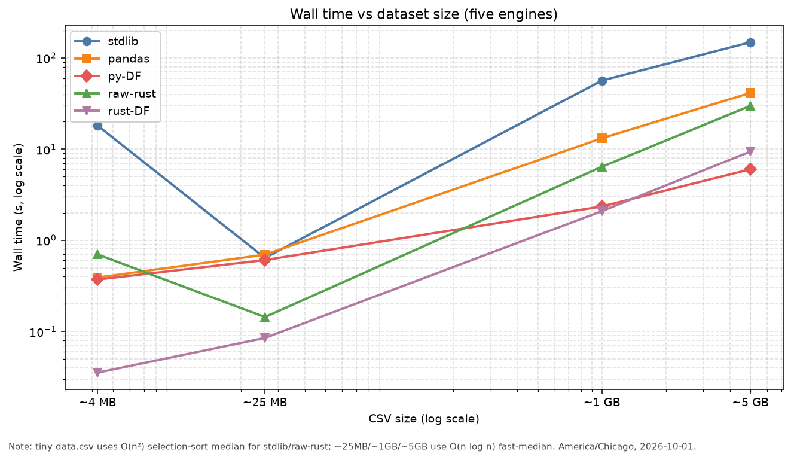
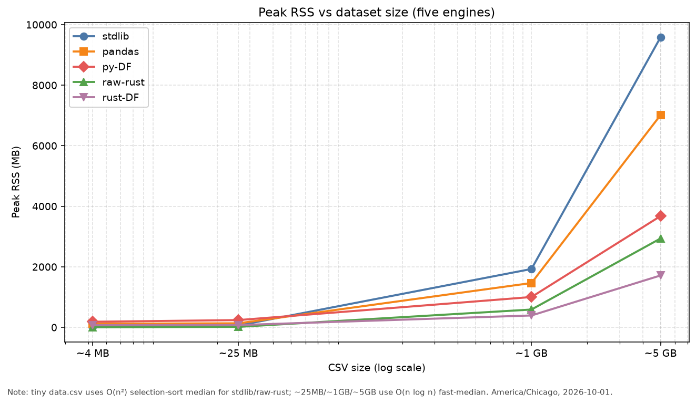

# Tutorial one — same-column stats bake-off

Same CSV + same column, compared across:

| Engine | Directory | How it runs |
|---|---|---|
| Pure Python (stdlib `csv` + math) | `python-stdlib/` | `python main.py <csv> <col>` |
| Pandas | `python-pandas/` | `python main.py <csv> <col>` |
| Apache DataFusion (Python) | `python-datafusion/` | `python main.py <csv> <col>` |
| Raw Rust (`csv` crate) | `raw-rust/` | `cargo build --release` → `target/release/rust-fun` |
| Apache DataFusion (Rust) | `rust-datafusion/` | `cargo build --release` → `target/release/rust-fun-apache` |

Metrics printed by each engine: count, total, min, max, average, median, sample variance, sample std dev.

## One-shot parent benchmark

From the lab venv (or any env with `pandas` + `datafusion` installed for the Python DF path):

```bash
cd /home/ben/Desktop/datafusion-fun-lab
./env/bin/python tutorial-one/benchmark.py ./data.csv oa_t
```

What the parent does:

1. **Compile timers** — `py_compile` for each Python `main.py` (bytecode); `cargo build --release` for each Rust crate (cold builds include dependency compile).
2. **Run timers** — each engine as a **subprocess** with the same `<csv> <column>` so results are comparable.
3. Prints a summary table: `compile_s`, `run_s`, **peak_rss_mb** (GNU `/usr/bin/time` Max RSS per child), OK/FAIL.

Flags:

- `--quiet-runs` — hide per-engine stdout (summary only)
- `--skip-build` — do not `cargo build` (fails if release binaries missing)
- `--fast-median` — force native O(n log n) median for stdlib / raw-Rust (also auto when CSV ≥ 1 GB)

For a large input (file size at least 1 GB), the harness automatically passes
`--fast-median` to the stdlib and raw-Rust programs. Use the flag explicitly
for mid-size files (e.g. ~25 MB) so they share the same big-data median path.
This selects the same median statistic with native O(n log n) sorting instead
of the deliberately O(n²) selection sort used by the small-data teaching baseline.

Python still compiles to `.pyc` at first run even without an explicit compile step; the harness measures that via `py_compile` so you can see it next to Rust’s `cargo build --release`.

## Manual runs

```bash
# Pure Python
./env/bin/python tutorial-one/python-stdlib/main.py ./data.csv oa_t

# Pandas
./env/bin/python tutorial-one/python-pandas/main.py ./data.csv oa_t

# DataFusion (Python)
./env/bin/python tutorial-one/python-datafusion/main.py ./data.csv oa_t

# Raw Rust
cd tutorial-one/raw-rust && cargo build --release
./target/release/rust-fun ../../data.csv oa_t

# DataFusion (Rust)
cd tutorial-one/rust-datafusion && cargo build --release
./target/release/rust-fun-apache ../../data.csv oa_t
```

## Fresh benchmark (2026-10-01, America/Chicago)

Dataset: `data.csv`, column: `oa_t`, lab venv: `env/bin/python`.
The release binaries were already built; this run used `--quiet-runs --skip-build`.

| Engine | Compile (s) | Run (s) | Peak RSS (MB) | Status |
|---|---:|---:|---:|---|
| `python-stdlib` | 0.0016 | 18.1533 | 12.39 | OK |
| `python-pandas` | 0.0006 | 0.3908 | 120.32 | OK |
| `python-datafusion` | 0.0008 | 0.3714 | 185.66 | OK |
| `raw-rust` | — | 0.6996 | 2.45 | OK |
| `rust-datafusion` | — | 0.0353 | 73.74 | OK |

Compile time for Python is `py_compile`; Rust compile time is omitted here because
`--skip-build` was used after rebuilding `raw-rust` with `cargo build --release`.
Peak RSS is GNU `/usr/bin/time` Max RSS (`%M`) for each child process.


## ~25MB `DryBulb_Temp_F` experiment

Same generator / schema as the 1GB and 5GB DryBulb files, placed **between**
tiny `data.csv` and ~1GB to probe where Pandas vs DataFusion starts to diverge.
Uses the **same big-data median path** (native O(n log n)) via harness
`--fast-median` (file is below the auto ≥1 GB threshold).

```bash
./env/bin/python tutorial-one/generate_hourly_dry_bulb_5gb.py \
  -o tutorial-one/data/hourly_dry_bulb_25mb.csv --target-gb 0.025
./env/bin/python tutorial-one/benchmark.py \
  tutorial-one/data/hourly_dry_bulb_25mb.csv DryBulb_Temp_F \
  --quiet-runs --skip-build --fast-median
```

Dataset and run metadata (2026-10-01, America/Chicago):

- File: `tutorial-one/data/hourly_dry_bulb_25mb.csv` (ignored; never committed)
- Rows: **1,000,000**; size: **26,000,025** bytes (**0.0242** GiB / ~25 MB decimal target)
- Median: forced `--fast-median` → native O(n log n) for `python-stdlib` / `raw-rust`. Pandas and both DataFusion engines use their native aggregates.

| Engine | Run (s) | Peak RSS (MB) | Status |
|---|---:|---:|---|
| `python-stdlib` | 0.6398 | 62.64 | OK |
| `python-pandas` | 0.6952 | 134.59 | OK |
| `python-datafusion` | 0.6067 | 240.82 | OK |
| `raw-rust` | 0.1438 | 17.31 | OK |
| `rust-datafusion` | 0.0849 | 76.45 | OK |

**Where ~25MB lands (Pandas vs DataFusion).** At this size, **Python DataFusion is only marginally faster than Pandas** (~0.61s vs ~0.70s) while using **more** peak RSS (~241 MB vs ~135 MB). Rust DataFusion is clearly fastest (~0.085s) with moderate RSS. Compared with ~1GB (where Py DF is ~5–6× faster than Pandas), **~25MB is still in the “startup / planning overhead” regime** — leaving Pandas for DataFusion is not yet strongly motivated on wall clock alone. Use this point as the bridge between tiny `data.csv` and the ~1GB crossover.

## ~5GB `DryBulb_Temp_F` experiment

The generator is chunk-streaming and keeps the CSV out of git:

```bash
./env/bin/python tutorial-one/generate_hourly_dry_bulb_5gb.py
./env/bin/python tutorial-one/benchmark.py \
  tutorial-one/data/hourly_dry_bulb_5gb.csv DryBulb_Temp_F \
  --quiet-runs --skip-build
```

Dataset and run metadata (2026-10-01, America/Chicago):

- File: `tutorial-one/data/hourly_dry_bulb_5gb.csv` (ignored; never committed)
- Rows: **192,400,000**; size: **5,002,400,025** bytes (**4.6588** GiB)
- Median: the big-file run uses native O(n log n) median paths for
  `python-stdlib` and `raw-rust`; Pandas and both DataFusion engines use their
  native aggregate implementations. This is intentionally not the small-file
  O(n²) selection-sort comparison.

| Engine | Run (s) | Peak RSS (MB) | Status |
|---|---:|---:|---|
| `python-stdlib` | 148.4826 | 9586.77 | OK |
| `python-pandas` | 41.3542 | 7016.17 | OK |
| `python-datafusion` | 6.0083 | 3678.01 | OK |
| `raw-rust` | 29.8033 | 2937.71 | OK |
| `rust-datafusion` | 9.3985 | 1715.76 | OK |

**Takeaway.** On this larger scan, DataFusion's columnar execution and
streaming/parallel planning can pay off versus Python object-heavy processing,
while raw Rust remains a low-memory baseline. The result is a scan-and-aggregate
comparison; the median algorithm is explicitly changed for scale, so it should
not be read as a selection-sort apples-to-apples result.


## ~1GB `DryBulb_Temp_F` experiment

Same generator, same column, same big-data median path (native O(n log n)):

```bash
./env/bin/python tutorial-one/generate_hourly_dry_bulb_5gb.py \
  -o tutorial-one/data/hourly_dry_bulb_1gb.csv --target-gb 1.0
./env/bin/python tutorial-one/benchmark.py \
  tutorial-one/data/hourly_dry_bulb_1gb.csv DryBulb_Temp_F \
  --quiet-runs --skip-build
```

Dataset and run metadata (2026-10-01, America/Chicago):

- File: `tutorial-one/data/hourly_dry_bulb_1gb.csv` (ignored; never committed)
- Rows: **38,500,000**; size: **1,001,000,025** bytes (**0.9323** GiB)
- Median: native O(n log n) for `python-stdlib` / `raw-rust` (harness auto-passes `--fast-median` when the CSV is ≥ 1 GB). Pandas and both DataFusion engines use their native aggregates.

| Engine | Run (s) | Peak RSS (MB) | Status |
|---|---:|---:|---|
| `python-stdlib` | 56.5242 | 1928.79 | OK |
| `python-pandas` | 13.1597 | 1465.49 | OK |
| `python-datafusion` | 2.3508 | 1002.88 | OK |
| `raw-rust` | 6.4030 | 589.27 | OK |
| `rust-datafusion` | 2.0895 | 393.18 | OK |

**Is 1GB worth testing?** Yes. Tiny `data.csv` and ~5GB leave a large gap: at ~1GB you already see DataFusion pull ahead of Pandas on wall clock (~2.1–2.4s vs ~13s) and RSS drop below the Python object-heavy paths, without waiting for a multi-minute 5GB scan. It is the practical mid-point for crossover claims.

## Apples-to-apples scope

`python-stdlib` and `raw-rust` intentionally use the direct standard-library
container equivalents: Python `list[float]` and Rust `Vec<f64>` (not
`array.array` or NumPy). Both use the same load algorithm: read the header,
find the column index, loop over rows, parse `f64`, and skip unparseable values.
Python uses the stdlib `csv` module; Rust uses the `csv` crate because Rust has
no CSV parser in its standard library. Both use hand-coded selection sort for
the median and sample variance (`n - 1`, or `0.0` for one value).


## Complexity, memory, and when to leave Pandas for DataFusion

### Teaching baseline vs big-data path (big-O)

| Path | Median | Rest of stats | Intent |
|---|---|---|---|
| Small CSV (`data.csv`) | Hand-coded **selection sort** → **O(n²)** | O(n) scan | Teaching toy — comparable stdlib/Rust loops, *not* a production median |
| Big / mid CSV (`--fast-median` or ≥ 1 GB) | Native sort / engine aggregate → **O(n log n)** median + **O(n)** aggregates | Same | Fair scan-and-aggregate bake-off |

Do not mix the two when quoting speedups. The small-file table is an O(n²) teaching comparison; the 25MB / 1GB / 5GB tables are O(n log n) sort + O(n) stats.

### Measured points from this lab (America/Chicago, 2026-10-01)

Wall clock (`run_s`) and peak RSS (GNU `/usr/bin/time` Max RSS):

| Scale | Rows (approx) | Fastest engine (run_s) | Pandas run_s | Py DataFusion run_s | Rust DataFusion run_s |
|---|---:|---:|---:|---:|---:|
| Tiny `data.csv` | small | `rust-datafusion` **0.035** | 0.391 | 0.371 | **0.035** |
| ~25 MB DryBulb | 1.0M | `rust-datafusion` **0.085** | 0.695 | 0.607 | **0.085** |
| ~1 GB DryBulb | 38.5M | `rust-datafusion` **2.09** | 13.16 | 2.35 | **2.09** |
| ~5 GB DryBulb | 192.4M | `python-datafusion` **6.01** | 41.35 | **6.01** | 9.40 |

Peak RSS at the same points (MB):

| Scale | stdlib | pandas | py-DF | raw-rust | rust-DF |
|---|---:|---:|---:|---:|---:|
| Tiny | 12 | 120 | 186 | 2.5 | 74 |
| ~25 MB | 63 | 135 | 241 | **17** | 76 |
| ~1 GB | 1929 | 1465 | 1003 | 589 | **393** |
| ~5 GB | 9587 | 7016 | 3678 | 2938 | **1716** |

### Plots (wall time & peak RSS)

Regenerated from checked-in `docs/plots/bench_results.csv` (same numbers as the tables above; needs `matplotlib` in the lab venv):

```bash
./env/bin/python tutorial-one/docs/plots/plot_bench.py
```





Log-x on CSV size for both; wall time also uses log-y so the Pandas → DataFusion crossover (~25 MB → ~1 GB) stays readable next to the slow stdlib path.


### Package footprint (measured 2026-10-01, America/Chicago)

Measured in the lab's `env/` Python 3.12 environment; wheel sizes are `pip download --no-deps` artifacts, and installed sizes are `du` for the package directory only (not dependencies):

| Implementation | Version | Wheel / crate download | Installed package / release binary |
|---|---:|---:|---:|
| Pandas (Python) | 3.0.6 | 10,788,193 bytes (10.8 MB) wheel | 67,438,969 bytes (72 MiB) package directory |
| DataFusion (Python) | 54.0.0 | 41,050,149 bytes (41.1 MB) wheel | 120,055,800 bytes (115 MiB) package directory |
| DataFusion (Rust) | 55.1.0 Cargo dependency | 306,973 bytes (307 kB) `.crate` download | 174,912,696 bytes (174.9 MB) `rust-fun-apache` release binary |

**Takeaway.** Python DataFusion has the larger install footprint (about 3.8× the wheel and 1.7× the package directory of Pandas), while the Rust crate download is tiny but the linked release binary is large; footprint is a deployment tradeoff, not a runtime result—this lab's scan benchmarks show DataFusion's runtime advantage becoming clear around the ~1 GB input.

### Practical crossover guidance (from these numbers)

1. **Tiny CSVs** — Pandas (or even stdlib) is fine. DataFusion’s startup / planning overhead dominates; Rust DataFusion wins the tiny table but the absolute gap is sub-second.
2. **~25 MB** — Still near the tiny regime for Pandas vs **Python** DataFusion: ~0.70s vs ~0.61s with Py DF using *more* RSS (~241 vs ~135 MB). **Rust DataFusion** already leads (~0.085s). Do not cite ~25MB as leave-Pandas evidence for the Python DF path — the clear wall-clock win shows up by ~1GB.
3. **~1 GB** — Leaving Pandas for DataFusion is already clearly motivated: ~**5–6×** faster wall clock (13s → ~2s) and lower RSS than Pandas. Prefer **Rust DataFusion** here if you want the lowest peak RSS (**393 MB** vs Py DF **1003 MB**) with similar latency (**2.09s** vs **2.35s**).
4. **~5 GB** — DataFusion remains the right class of tool vs Pandas (~**7×** faster: 41s → ~6–9s). In *this* lab’s measured runs, **Python DataFusion was faster than Rust DataFusion** (**6.01s** vs **9.40s**) while using more RAM (**3678** vs **1716 MB**). Treat that as a measured tradeoff on this machine/workload (CSV scan + SQL aggregates), not a universal ranking — re-run if your schema, filters, or hardware differ.
5. **Memory vs wall clock** — Raw Rust is a strong low-RSS baseline at every scale but loses to DataFusion on wall clock once n is large (columnar + parallel planning). Stdlib Python is the high-RSS, high-latency teaching path once you leave the tiny file.
6. **When to leave Pandas** — If your working set is still comfortably under ~tens of MB and interactive notebooks matter more than fractions of a second, stay on Pandas. At ~25MB the Py DF edge is tiny. Once you are in the **~1 GB+** CSV scan/aggregate regime (this lab’s DryBulb path), DataFusion (Py or Rust) is the better default for both time and RSS.

### Python DataFusion vs Rust DataFusion (this lab)

| Scale | Winner (wall) | Winner (RSS) | Note |
|---|---|---|---|
| Tiny | Rust DF | Raw Rust (then Rust DF among DF) | Absolute times are tiny |
| ~25 MB | Rust DF | Raw Rust (then Rust DF among DF) | Py DF approx Pandas on wall; Rust DF wins |
| ~1 GB | Rust DF (slightly) | Rust DF | Close on time; Rust DF ~2.5× less RSS |
| ~5 GB | **Python DF** | Rust DF | Py faster here; Rust leaner |

Honesty check: selection-sort small benches are O(n²) toys. Big-data numbers above are the ones to cite for “should I leave Pandas?”

## How to test (copy-paste)

Large / mid CSVs are **gitignored** (`tutorial-one/data/hourly_dry_bulb_25mb.csv`, `…_1gb.csv`, `…_5gb.csv`, and `**/*_25mb.csv` / `**/*_1gb.csv` / `**/*_5gb.csv`). Generate them locally; never commit them.

### 0) Lab root + venv

```bash
cd /home/ben/Desktop/datafusion-fun-lab
# prefer the lab venv so pandas + datafusion match
./env/bin/python -c "import pandas, datafusion; print('ok')"
```

### 1) Generate ~25 MB, ~1 GiB, and ~5 GiB DryBulb CSVs

The chunk-streaming generator writes `Timestamp,DryBulb_Temp_F`, wraps simulated years every 8000 calendar years (no `datetime` overflow), and stops after a chunk boundary near the target size:

```bash
# ~25 MB (decimal) → tutorial-one/data/hourly_dry_bulb_25mb.csv
./env/bin/python tutorial-one/generate_hourly_dry_bulb_5gb.py \
  -o tutorial-one/data/hourly_dry_bulb_25mb.csv --target-gb 0.025

# ~1 GB (decimal) → tutorial-one/data/hourly_dry_bulb_1gb.csv
./env/bin/python tutorial-one/generate_hourly_dry_bulb_5gb.py \
  -o tutorial-one/data/hourly_dry_bulb_1gb.csv --target-gb 1.0

# ~5 GB (default path tutorial-one/data/hourly_dry_bulb_5gb.csv)
./env/bin/python tutorial-one/generate_hourly_dry_bulb_5gb.py --target-gb 5.0

# confirm ignored
git check-ignore -v tutorial-one/data/hourly_dry_bulb_25mb.csv \
  tutorial-one/data/hourly_dry_bulb_1gb.csv \
  tutorial-one/data/hourly_dry_bulb_5gb.csv
```

### 2) Build Rust release binaries (once, or after code changes)

```bash
(cd tutorial-one/raw-rust && cargo build --release)
(cd tutorial-one/rust-datafusion && cargo build --release)
```

### 3) Run the five-engine big-data bench

The harness auto-enables `--fast-median` (native O(n log n)) when the CSV is ≥ 1 GB. For ~25 MB, pass `--fast-median` explicitly so stdlib / raw-Rust share the same big-data median path. Peak RSS is Max RSS from GNU `/usr/bin/time -f %M` (kB → MB) on each child; wall clock is `perf_counter` around that child.

```bash
# ~25 MB (force big-data median path)
./env/bin/python tutorial-one/benchmark.py \
  tutorial-one/data/hourly_dry_bulb_25mb.csv DryBulb_Temp_F \
  --quiet-runs --skip-build --fast-median

# ~1 GB (auto --fast-median)
./env/bin/python tutorial-one/benchmark.py \
  tutorial-one/data/hourly_dry_bulb_1gb.csv DryBulb_Temp_F \
  --quiet-runs --skip-build

# ~5 GB
./env/bin/python tutorial-one/benchmark.py \
  tutorial-one/data/hourly_dry_bulb_5gb.csv DryBulb_Temp_F \
  --quiet-runs --skip-build

# tiny teaching baseline (selection-sort median; different big-O)
./env/bin/python tutorial-one/benchmark.py ./data.csv oa_t \
  --quiet-runs --skip-build
```

Omit `--skip-build` if release binaries may be missing (cold `cargo build --release` will be timed into `compile_s`).

### 4) Re-publish README tables

1. Capture the harness summary lines (`engine`, `run_s`, `peak_rss_mb`, status).
2. Record file bytes + row count from the generator stdout (or `wc` / `stat`).
3. Update the matching section in `tutorial-one/README.md` (tiny / ~25MB / ~1GB / ~5GB), including date + `America/Chicago`.
4. Refresh the crossover summary table if rankings changed.
5. Update `tutorial-one/docs/plots/bench_results.csv` with the new `run_s` / `peak_rss_mb` rows, then regenerate plots:

```bash
./env/bin/python tutorial-one/docs/plots/plot_bench.py
```

6. Commit **docs + code + plot PNGs/CSV/script only** — not the large data CSVs:

```bash
git status   # confirm *.csv under tutorial-one/data/ are ignored
git add tutorial-one/README.md tutorial-one/benchmark.py \
  tutorial-one/generate_hourly_dry_bulb_5gb.py .gitignore \
  tutorial-one/docs/plots/
git commit -m "Your message"
git push origin develop
```

## Notes

- Prefer the lab `env/` Python so Pandas / DataFusion bindings match.
- Raw Rust and Rust DataFusion binaries are separate crates; the parent builds both before timing runs unless `--skip-build`.
- `python-datafusion` and `rust-datafusion` both use SQL aggregates over Arrow; Pandas / stdlib / raw Rust compute in-process over parsed floats.
